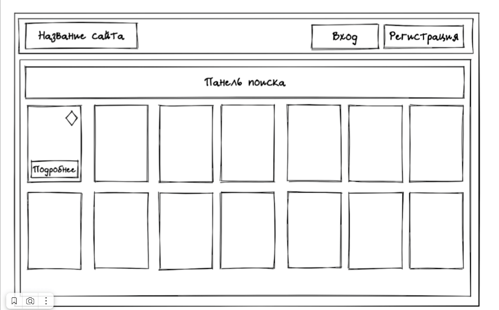

# Интенсив ReactJS 33

## Описание задач lesson_3

### Сайт состоит из шапки, которая не ререндерится между переходами по страницам.

### При клике на название сайта (картинка/лого) должен произойти переход на корневой рут (/).

### Кнопка Вход - переходит на страницу входа (/signin).

### Кнопка Регистрация - переходит на страницу регистрации (/signup).

### После регистрации или входа по учетной записи, кнопки Вход и Регистрация должны исчезнуть, а вместо них отобразиться имя учетной записи и кнопки:

### Избранное - переход на страницу /favorites. Там отображаются карточки с единицами информации, которые ранее были добавлены в избранное.

### урл /favorites доступен только авторизованному пользователю. Неавторизованного пользователя должно редиректить на /signin

### урл /history доступен только авторизованному пользователю. Неавторизованного пользователя должно редиректить на /signin

### При вводе в инпут можно показывать какие-то саджесты, например первых 5 результатов и при клике на саджест сразу перенаправлять пользователя на страницу с единицей информации.

### Когда пользователь заполнил поле поиска и нажал Найти, можно перебросить пользователя на урл /search?тут*query*параметры, чтобы удобно работать с поиском и перезагрузками этой страницы. Либо можете построить процесс поиска как-нибудь по-другому на ваше усмотрение. Это зависит от АПИ, которое вы выбрали.

### На странице /search будут отображаться Панель поиска и под панелью отображаем карточки единиц информации.

## Основные функции приложения:

### логирование/регистрация

### получение данных по апи с поиском и получением отдельной карточки

### на странице поиска можно выбрать картинки в избранное

### на странице избранное можно посмотреть выбранные картинки и удалить их

## Технические требования:

### Приложение разработано с использованием "react": "18.2.0", "redux": "5.0.1", react-router-dom: "6.22.1", ts.

## Установка зависимостей:

### После загрузки приложения на компьютер необходимо выполнить команду npm install для установки всех зависимостей, необходимых для работы приложения.

## Запуск приложения:

### После установки зависимостей приложение можно запустить с помощью команды npm run start. Запущенное приложение будет доступно на локальном сервере.

## Что в доработке:

### Избранное и История поиска также сохраняется в LS - пока не сделано

## P.S. Команда:

### Gleb (signin/signup)

### Roman (favorites/history)

### Arkadiy (search/каркас приложения)

[Open the Application](https://main--storied-fudge-41aa58.netlify.app/)

